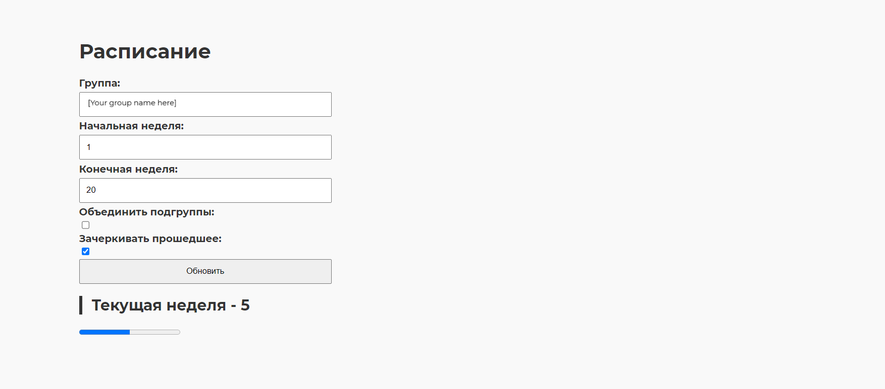
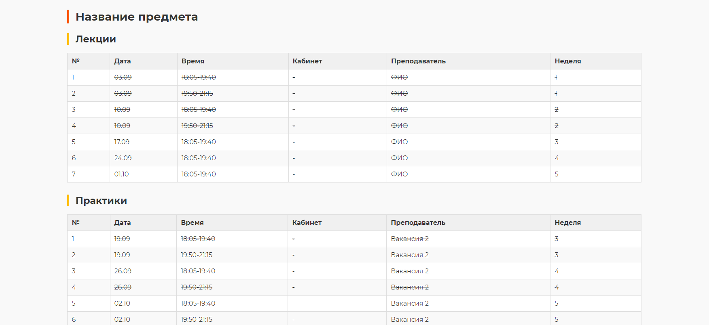

# NiceRaspUSPTU

## Description

A project that allows you to view the schedule in a markdown table format, making it easy to see when subjects begin and end, as well as how many laboratory sessions are remaining.




## Features

- Nice webui with fastapi
- Retrieve schedule by group name and interval of weeks
- Display results in markdown format (render in html with marked.js)
- hide past lessons
- Option to divide by subgroups

## How to Run

Set environment variables in the Command Prompt like this:

```cmd
set endpoint="https://URL/"
set groupname="AAA00-00-00"
```

Or, you can set environment variables in PowerShell like this:

```powershell
$env:endpoint = "https://URL/"
$env:groupname = "AAA00-00-00"
```

Then execute:

```bash
uvicorn main:app --reload
```

You can access the app at:

```
http://localhost:8000
```

## Use with docker

Build with docker

```powershell
docker-compose up --build
```

You can access the app at:

```
http://localhost:8000
```